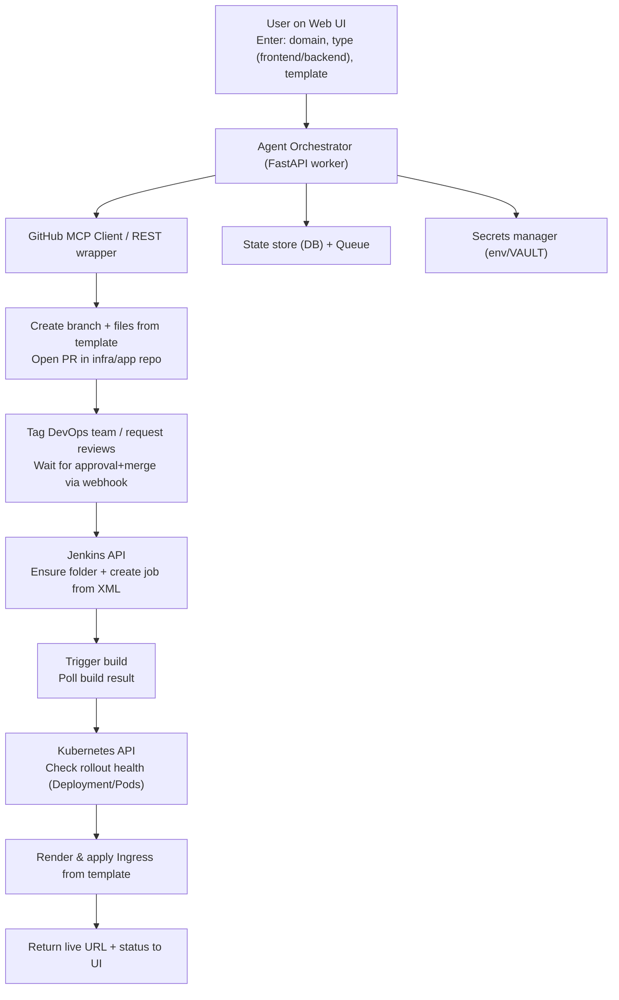

### AI Agent–Driven Website Provisioning: End-to-End Design, Runbook, and Integration Guide

## Executive summary
- Build a Python FastAPI “agent” that scaffolds apps from templates, opens a PR tagging DevOps for approval, on merge provisions via Jenkins, validates K8s rollout, and applies an Ingress.
- Integrates GitHub (MCP server or REST), Jenkins API, Kubernetes API, with simple UI and a stateful workflow.
- This page includes architecture, flow, API design, templates, security, runbook, and rollout/rollback steps. Speaker notes included.

## High-level workflow
- User submits: domain (e.g., labeling-tool.turing.com), app type (frontend/backend), template.
- Agent:
  - Creates branch and PR from template, tags DevOps.
  - Waits for approval/merge (via GitHub webhook).
  - Creates Jenkins job in folder, triggers build and waits.
  - Verifies K8s deployment health.
  - Renders and applies an Ingress.
  - Returns live URL and status.

## Architecture diagram (Mermaid)


## Components
- Web UI: minimal form for domain/app type/template, status page.
- Agent Orchestrator: Python FastAPI, background tasks or RQ/Celery for reliability.
- GitHub integration: MCP GitHub server preferred (tooling provided by server), fallback to REST (PyGithub).
- Jenkins integration: REST API (CSRF crumb + token), create/update job, trigger build, poll queue/build.
- Kubernetes integration: Python client, check Deployment rollout, apply Ingress via NetworkingV1.
- Templates: application templates in GitHub repos; Ingress Jinja2 templates bundled with agent.
- State/queue: start with DB-free status store; grow to SQLModel+Postgres and RQ/Redis.

## Data model (minimal)
- ProvisionRequest
  - id, domain, app_type, template_id
  - repo, branch, pr_number, pr_url
  - jenkins_folder, jenkins_job, jenkins_build_number
  - k8s_namespace, deployment_name, ingress_name, live_url
  - status: PENDING_PR → PR_OPEN → WAITING_FOR_APPROVAL → MERGED → BUILDING → DEPLOYED → HEALTHY → INGRESS_APPLIED → COMPLETED | FAILED
  - error_message, created_at, updated_at

## API contract (FastAPI)
- POST `/provision`:
  - body: { domain, app_type: "frontend"|"backend", template_id }
  - returns: { provision_id, status: "PR_OPENING" }
- GET `/provision/{id}`:
  - returns current status and links (PR URL, build URL, live URL)
- POST `/webhooks/github`:
  - handles pull_request events; on merged, advances workflow
- Optional: GET `/healthz`

## Configuration and secrets
- GitHub
  - GITHUB_TOKEN (repo:contents, pull_requests:write, workflow:read)
  - GITHUB_OWNER, GITHUB_REPO (target repo for PR), GITHUB_DEVOPS_TEAM_SLUG
  - MCP_GITHUB_SERVER_ENDPOINT (if using MCP)
  - WEBHOOK_SECRET (HMAC for GitHub webhooks)
- Jenkins
  - JENKINS_URL, JENKINS_USER, JENKINS_TOKEN
- Kubernetes
  - KUBECONFIG (local) or in-cluster service account
  - K8S_NAMESPACE_DEFAULT, K8S_INGRESS_CLASS (e.g., nginx)
- Templates
  - TEMPLATE_REPOS or TEMPLATE_ROOT path
  - INGRESS_TEMPLATES_PATH
- App
  - DATABASE_URL (optional), REDIS_URL (optional)

## GitHub integration (MCP first, REST fallback)
- MCP server provides tools like:
  - create branch, write files/commits, open PR, request review, add labels.
- If MCP down/unavailable:
  - Use PyGithub:
    - Create branch from default
    - Commit/copy template files
    - Create PR, add labels (e.g., needs-devops-approval), request review from team slug
- Webhook:
  - Verify signature via WEBHOOK_SECRET
  - On action=closed and merged=true, resume pipeline

## Jenkins integration
- Ensure folder and job exist:
  - PUT folder; POST `/createItem` for job with XML `config.xml`
  - Prefer Pipeline job (Jenkinsfile in repo) or Freestyle with shell step
- Trigger build:
  - POST `/buildWithParameters`
  - Poll queue item → build number → `/api/json` result
- Output:
  - Track build URL, number, and status

## Kubernetes integration
- Wait for rollout:
  - Deployment Available=True and desired replicas ready
- Apply Ingress (NetworkingV1):
  - Render via Jinja2 with variables: `ingress_name`, `namespace`, `domain`, `service_name`, `service_port`, `ingress_class`, `tls_secret` (optional)

### Ingress template (example)
```yaml
apiVersion: networking.k8s.io/v1
kind: Ingress
metadata:
  name: {{ ingress_name }}
  namespace: {{ namespace }}
  annotations:
    kubernetes.io/ingress.class: {{ ingress_class | default("nginx") }}
spec:
  rules:
    - host: {{ domain }}
      http:
        paths:
          - path: /
            pathType: Prefix
            backend:
              service:
                name: {{ service_name }}
                port:
                  number: {{ service_port }}

  tls:
    - hosts: [{{ domain }}]
      secretName: {{ tls_secret }}

```

## Dependencies (Python)
- FastAPI, Uvicorn
- Requests, PyGithub (REST fallback)
- Jinja2
- kubernetes
- Optional: SQLModel + psycopg, Redis + RQ

## Security and compliance
- Least-privilege:
  - GitHub token scoped to repo; Jenkins user scoped to folder; K8s SA scoped to namespace
- Webhook HMAC validation; CSRF crumb for Jenkins
- Secrets from environment or vault; avoid logging sensitive data
- Audit trails: persist status transitions with timestamps and actor/action metadata

## Operational runbook
- Provision request stuck at PR_OPEN:
  - Check MCP/REST logs; verify GitHub token scopes; inspect repo protection rules
- PR merged but no build:
  - Verify webhook delivery; check `/webhooks/github` logs; confirm Jenkins credentials
- Build failed:
  - Open Jenkins console; fix template or pipeline; retry workflow step
- Deployment not healthy:
  - Inspect Pods, Events; roll back to previous image/tag
- Ingress not reachable:
  - Verify DNS, TLS secret, ingress class/controller logs
- Rollback strategy:
  - Re-run previous successful image tag
  - Revert PR; re-apply prior Ingress manifest

## Future enhancements
- Human-in-the-loop approvals in UI
- Multi-tenant namespaces and per-env routing
- GitHub App instead of PAT
- GitHub Actions as alternative to Jenkins
- Observability dashboards (Grafana, OpenTelemetry)

## Speaker notes (talk track)
- Problem: Reduce cycle time from request to live app via templates + approvals.
- Approach: Agent orchestrates GitHub PR → Jenkins build → K8s health → Ingress, with DevOps approval gate.
- Safety: Team review on PR; least-privilege credentials; audit trail.
- Outcome: Repeatable, fast, and secure provisioning with traceability; extensible templates.
